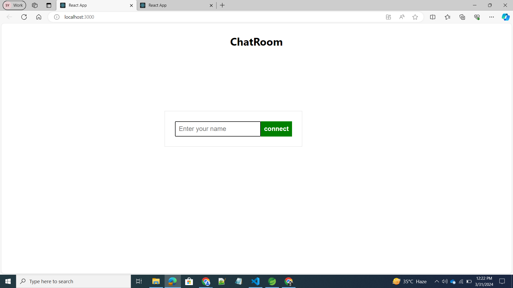
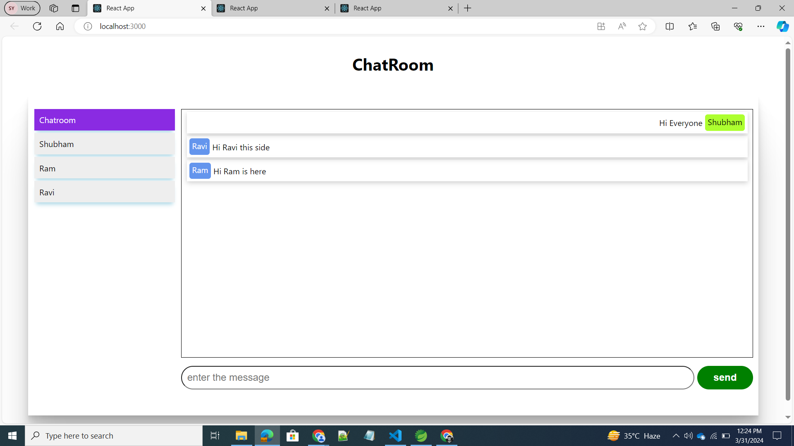
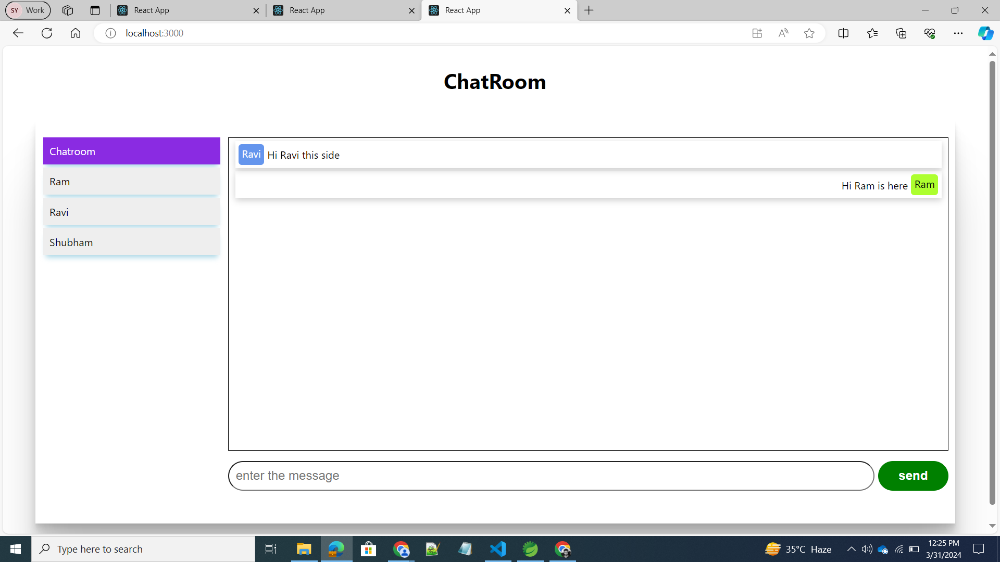

# ChatApp-Websocket-Stomp-SockJS
Real time chat application using websocket and stomp, sockJs

## Server: - Spring boot Websocket

## Client - ReactJS

## screen

To start:

## Client
    - npm install (to install all the dependency)
    - npm start

## Server
    - Start as spring boot App